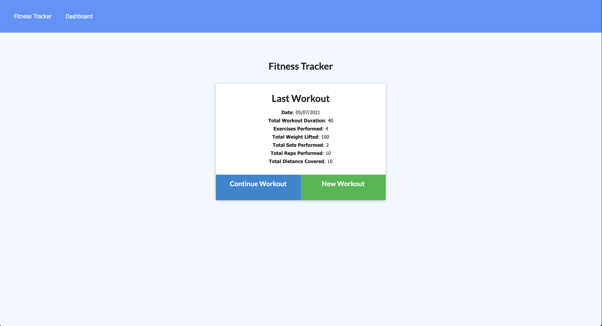
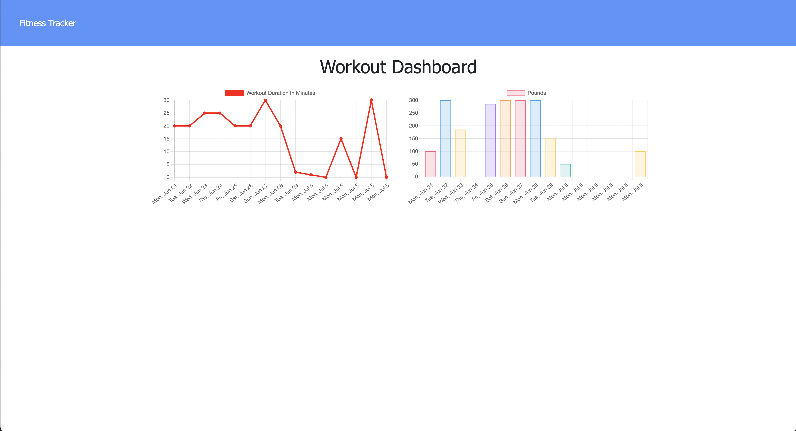

# fitness-tracker
Workout tracker using MongoDB and Mongoose

# Unit 18 Nosql Homework: Workout Tracker

A workout tracker with provided front end code. Using Mongo database with a Mongoose schema and handle routes with Express.

## Website

## User Story

* As a user, I want to be able to view create and track daily workouts. I want to be able to log multiple exercises in a workout on a given day. I should also be able to track the name, type, weight, sets, reps, and duration of exercise. If the exercise is a cardio exercise, I should be able to track my distance traveled.

## Business Context

A consumer will reach their fitness goals more quickly when they track their workout progress.

## Technologies Used

- Express
- Node.js
- MongoDB
- Mongoose
- Heroku
- MongoDB Atlas